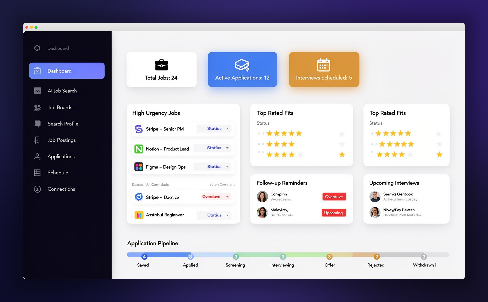

# JobTrackr

A comprehensive job search management application built with React, TypeScript, and Lovable Cloud. Track job postings, manage your application pipeline, nurture professional contacts, and stay on top of interviews — all in one place.

   



## Features

### 📊 Dashboard
- At-a-glance stats: total jobs, active applications, upcoming interviews
- High urgency jobs and top-rated fits widgets
- Follow-up reminders with overdue tracking
- Application pipeline breakdown by status

### 💼 Job Tracking
- **List & Kanban views** — drag-and-drop jobs between status columns
- Statuses: Saved → Applied → Screening → Interviewing → Offer / Rejected / Withdrawn / Closed
- Inline editing of status, fit score (1–5 stars), and urgency level
- Job detail panel with description, recruiter info, and linked contacts
- Bulk import jobs via CSV/Excel upload

### 📋 Job CRM
- Dedicated per-job CRM page (`/jobs/:id`) inspired by Salesforce Opportunity views
- Unified activity timeline merging status changes, interviews, and networking events
- Activity types: Cold Outreach, Introduction, Referral Request, Informational Chat, Follow Up, and more
- Conversation logs and next-step tracking per contact

### 👥 Contact Management
- Full CRM for professional relationships
- Relationship warmth tracking (Cold → Warm → Hot → Champion)
- Follow-up date scheduling with overdue alerts
- Activity logging and conversation notes
- Many-to-many outreach campaign management
- Contact-to-contact connections and org-level networking
- Recommendation request tracking
- LinkedIn profile import with AI-powered field extraction
- Bulk contact import via CSV/Excel

### 📅 Interviews
- Schedule and manage interviews (Phone, Technical, Behavioral, Onsite, Final)
- Calendar view with highlighted interview and follow-up dates
- Combined timeline of interviews and contact follow-ups

### 🔍 Job Search
- AI-powered job search with profile-based matching
- Job board management and tracking
- Dismiss irrelevant results to refine future searches

### 📝 Profile Editor
- Searchable job profile with target roles, skills, and preferences
- Resume parsing for auto-populating profile fields
- Used by AI search to match relevant opportunities

### 📈 Skills Insights
- Skills frequency analysis across tracked job postings
- Snapshot history for trending skill demand over time

### ✉️ Cover Letters
- AI-generated cover letters tailored to specific job postings
- Stored per job for easy access and iteration

## Tech Stack

| Layer | Technology |
|-------|-----------|
| **Frontend** | React 18, TypeScript 5, Vite 5 |
| **Styling** | Tailwind CSS 3, shadcn/ui, Radix UI |
| **State** | React hooks, TanStack React Query |
| **Routing** | React Router v6 |
| **Backend** | Lovable Cloud (Supabase) — Auth, Database, Edge Functions, Storage |
| **AI** | Lovable AI (Gemini, GPT) for job search, cover letters, resume parsing, LinkedIn scraping |
| **Charts** | Recharts |

## Getting Started

### Prerequisites
- Node.js 18+ and npm/bun

### Installation

```bash
# Clone the repository
git clone <your-repo-url>
cd jobtrackr

# Install dependencies
npm install

# Start the development server
npm run dev
```

The app will be available at `http://localhost:5173`.

### Environment Variables

The following environment variables are managed automatically when using Lovable Cloud:

| Variable | Description |
|----------|-------------|
| `VITE_SUPABASE_URL` | Backend API URL |
| `VITE_SUPABASE_PUBLISHABLE_KEY` | Public API key |

## Project Structure

```
src/
├── components/          # Reusable UI components
│   ├── ui/              # shadcn/ui primitives
│   ├── jobboards/       # Job board components
│   └── jobsearch/       # Job search components
├── hooks/               # Custom React hooks
├── integrations/        # Lovable Cloud client & types
├── pages/               # Route-level page components
├── stores/              # State management (jobTrackerStore)
├── types/               # TypeScript type definitions
└── lib/                 # Utility functions

supabase/
├── functions/           # Edge functions (AI search, scraping, etc.)
├── migrations/          # Database migrations
└── config.toml          # Backend configuration
```

## Authentication

JobTrackr uses email-based authentication with email verification. All data is scoped per user via Row-Level Security policies.

## License

This project is private. All rights reserved.

---

Built with [Lovable](https://lovable.dev)
